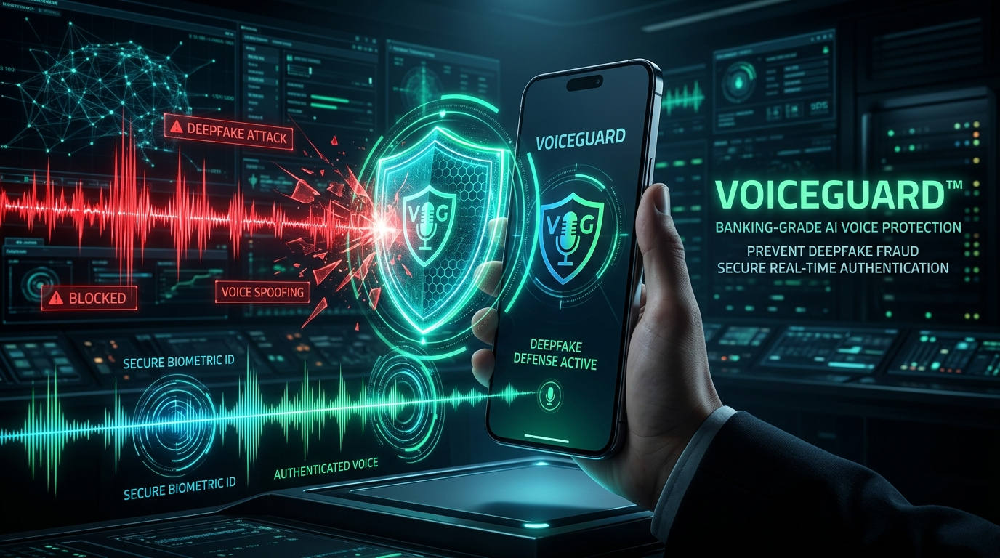
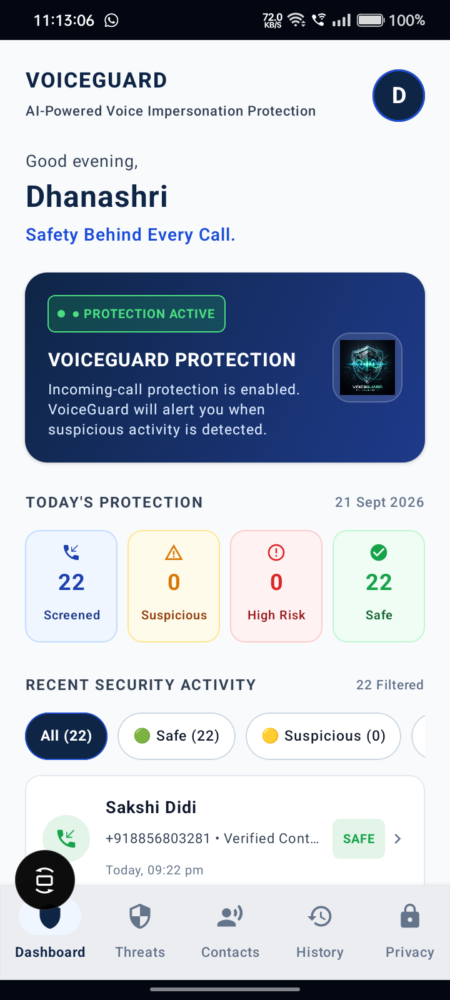
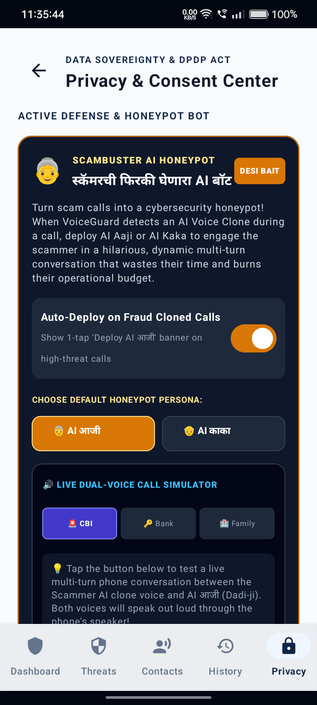
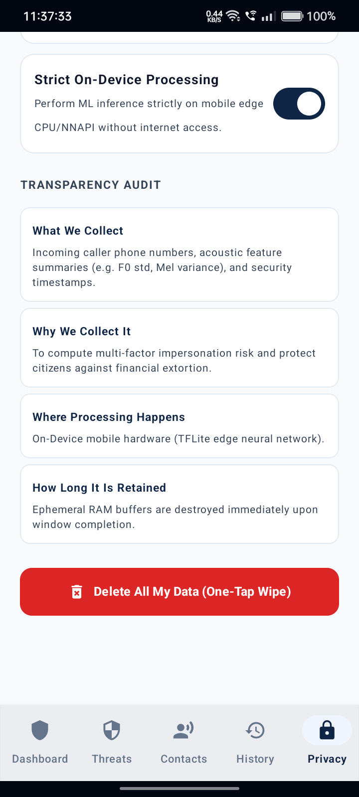
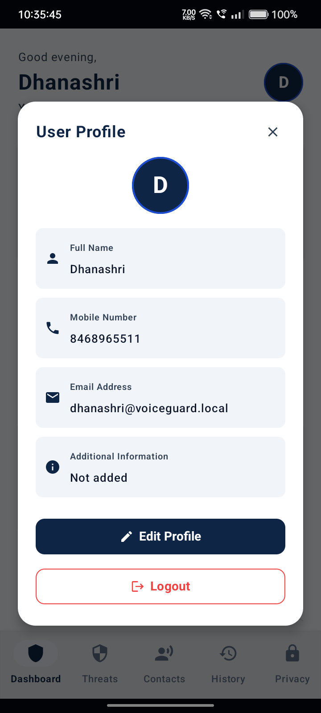
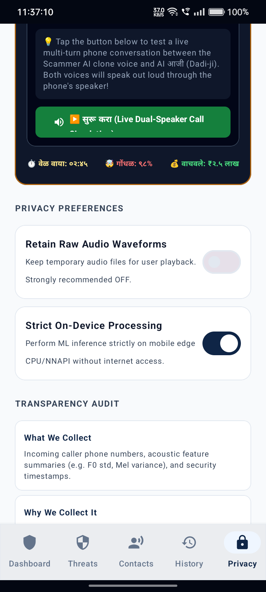

# 🛡️ VOICEGUARD — AI-Based Fake Identity & Biometric Voice Screening System

<p align="center">
  
</p>

<p align="center">
  <strong>"Safety Behind Every Call."</strong><br>
  <em>Smart India Hackathon 2026 | Problem Statement ID: <strong>SIH26188</strong> | Ministry of Home Affairs (MHA)</em><br>
  <em>Team: <strong>NEX ERA</strong> (Team ID: 161860) | Theme: Blockchain & Cybersecurity (Software)</em>
</p>

<p align="center">
  
  
  
  
  
  
</p>

---

## 📌 Executive Overview — Problem Statement SIH26188

> **Problem Statement Title**: *AI-Based Fake Identity & Document Screening System*  
> **Target Authority**: *Ministry of Home Affairs (MHA) / National Cybercrime Reporting (1930)*

With generative AI audio tools enabling hyper-realistic voice clones within 3 seconds of reference audio, cybercriminals are conducting targeted financial extortion, fake kidnapping ransom calls, and **"CBI/Police Digital Arrest"** scams using forged credentials and synthetic identity impersonation. Standard spam blockers only inspect static caller IDs — they cannot tell when a caller's voice is synthetic or impersonating a trusted official or family member.

**VoiceGuard** solves this by providing an end-to-end, on-device AI screening platform:
1. **Biometric Voice Identity Screening**: Real-time vocoder discontinuity and neural phase analysis to detect synthetic AI voices during live calls (< 80ms).
2. **Credential & Identity Screening**: Automated screening of fake police warrants, digital arrest summons, and spoofed authority credentials.
3. **Active Defense (Honeypot Bot)**: Autonomous decoy personas (AI आजी / काका) that engage scammers, wasting their bandwidth and capturing actionable threat telemetry for law enforcement.
4. **100% On-Device Privacy**: DPDP Act 2023 compliant with zero raw audio transmission to cloud servers.

> **Guiding Principle**: *"Screen the identity, not just the phone number."*

---

## 📱 Visual Interface & Live Screenshots

<p align="center">
  
  &nbsp;&nbsp;&nbsp;&nbsp;
  
  &nbsp;&nbsp;&nbsp;&nbsp;
  
</p>

| **Dashboard & Call Screening** | **Active Defense AI Honeypot** | **Privacy & Consent Center** |
| :--- | :--- | :--- |
| Dynamic in-call security dashboard displaying live calendar date counters (`Screened = Safe + Suspicious + High Risk`), filtered incident feed, and real-time caller verification. | Autonomous counter-defense bot with dual persona options (**AI आजी** & **AI काका**) to trap scammers in dynamic multi-turn dialogue. | DPDP Act 2023 compliant data governance with on-device toggle, transparency collection audit, and 1-tap permanent data purge. |

<p align="center">
  
  &nbsp;&nbsp;&nbsp;&nbsp;
  
</p>

---

## ⚡ Key Capabilities & Architecture

### 1. 🎙️ Real-Time Acoustic Forensics & Vocoder Discontinuity Detection
- Sliding-window (1.5s) on-device analysis of carrier audio waveforms.
- Detects neural vocoder phase artifacts (HiFi-GAN, WaveGlow, Diffusion-TTS) and high-frequency spectral distortions (> 3.2 kHz).
- Distinguishes genuine human voice biology from synthetic mathematical reconstructions.

### 2. 👵 Active Defense & ScamBuster AI Honeypot ("Desi Bait")
- When an AI voice clone or high-risk scam call is detected, VoiceGuard enables 1-tap deployment of an Indian conversational counter-bot.
- **Selectable Personas**:
  - 👵 **AI आजी (Dadi-ji)**: Confused, hearing-impaired elder who derails OTP urgency with grandmotherly anecdotes.
  - 👴 **AI काका (Tau-ji)**: Skeptical elder demanding official government credentials and bureau addresses.
- **Dual-Voice Real-Time Simulator**: Built-in interactive test suite with realistic scam scenarios (*CBI Digital Arrest*, *Bank OTP Theft*, *Family Emergency*) that speaks dialogue through device speakers.

### 3. ⚖️ 5-Factor Calibrated Risk Engine
$$\text{Risk Score} = 0.35 \cdot V_{\text{voice}} + 0.20 \cdot C_{\text{caller}} + 0.15 \cdot S_{\text{speaker}} + 0.20 \cdot I_{\text{intent}} + 0.10 \cdot H_{\text{history}}$$
- Applies Exponential Moving Average (EMA) temporal smoothing ($\alpha = 0.40$) to prevent transient false alerts.

### 4. 🔒 Data Sovereignty & DPDP Act 2023 Compliance
- **Zero Raw Audio Retention**: Voice feature vectors are processed in ephemeral volatile memory (RAM) and destroyed immediately upon inference.
- **Strict On-Device Processing**: Option to run neural inference purely on edge hardware without external API egress.
- **One-Tap Data Wipe**: Instantly purges all enrolled voice embeddings, caller logs, and local preferences.

---

## 📂 Repository Directory Structure

```
AI-Voice_Guard_/
├── android/                         # Native Android Application (Kotlin, Jetpack Compose)
│   ├── app/
│   │   ├── src/main/java/com/voiceguard/
│   │   │   ├── data/local/          # SharedPreferences & Persistent Secure Storage
│   │   │   ├── domain/              # 5-Factor Risk Fusion & Security Models
│   │   │   ├── telecom/             # CallScreeningService & Android Telephony Integration
│   │   │   ├── ui/
│   │   │   │   ├── components/      # Dynamic Risk Rings, Badges, Metrics Cards
│   │   │   │   ├── navigation/      # Material3 Navigation Bar & Routing
│   │   │   │   ├── screens/         # Dashboard, Threats, Contacts, History, Privacy
│   │   │   │   └── theme/           # National Digital Identity Gov Design System
│   │   │   └── utils/               # ScamBuster AI Honeypot Engine & Audio Synthesizer
│   │   └── AndroidManifest.xml
│   ├── build.gradle.kts
│   └── settings.gradle.kts
│
├── backend/                         # FastAPI Microservice & Live WebSocket Service
│   ├── app/
│   │   ├── api/v1/                  # REST APIs & Streaming Audio Endpoints
│   │   ├── database/                # Audit trails & Threat Intelligence Store
│   │   └── services/                # Multilingual Indic NLU & Forensic Processing
│   └── tests/                       # Automated Pytest Suite
│
├── ml-engine/                       # Machine Learning Training & Export Pipelines
│   ├── models/                      # SpectroCNNAttention & AASIST-Light Architectures
│   ├── preprocessing/               # Mel-Spectrogram Extractors & GSM Audio Degradation
│   ├── training/                    # Zero-Speaker-Leakage Training Script
│   └── export/                      # ONNX & TFLite Quantization and Export Pipeline
│
├── assets/                          # Design assets, presentation banners & screenshots
│   ├── screenshots/                 # High-resolution production app screenshots
│   └── voiceguard_presentation_banner.jpg
│
├── docs/                            # Technical Documentation & Guides
│   ├── architecture.md              # System Architecture & Telephony Lifecycle
│   ├── threat-model.md              # STRIDE Telephony Attack Matrix
│   └── privacy.md                   # Zero-Retention DPDP Governance Spec
│
├── docker/                          # Docker container configs for backend
├── .gitignore                       # Clean repository exclusions
└── README.md
```

---

## 🚀 Quick Start & Installation

### 1. Android Application Setup
1. Clone the repository:
   ```bash
   git clone https://github.com/Dhanashri-7/AI-Voice_Guard_.git
   cd AI-Voice_Guard_/android
   ```
2. Open the project in **Android Studio Ladybug (2024.2+)** or newer.
3. Ensure JDK 17 or JDK 21 is selected in Gradle Settings.
4. Build and run on an Android 12+ device:
   ```bash
   ./gradlew assembleDebug
   adb install -r app/build/outputs/apk/debug/app-debug.apk
   ```
5. Grant required telephony and notification permissions during onboarding.

### 2. Python Backend & Streaming Analysis Server
```bash
cd backend
python -m venv .venv
source .venv/bin/activate  # On Windows: .venv\Scripts\activate
pip install -r requirements.txt
python -m pytest tests/    # Run test suite
python app/main.py         # Runs FastAPI server on http://localhost:8000
```
- Interactive OpenAPI docs: `http://localhost:8000/docs`

### 3. ML Model Export
```bash
cd ml-engine
pip install -r requirements.txt
python training/train.py
python export/export_onnx.py
```

---

## 🛡️ Security & Privacy Assurance

- **No Eavesdropping**: Raw audio streams are never transmitted to external cloud servers or stored in persistent databases.
- **Telecom Sandboxing**: Built using Android's official `CallScreeningService` without requiring root or hazardous accessibility compromises.
- **Open Standards**: Ready for integration with National Cyber Crime Reporting Portal (**1930 Helpline** / `cybercrime.gov.in`).

---

## 👥 Team & Submission Details

- **Team Name**: NEX ERA
- **Team ID**: 161860
- **Lead Developer**: Dhanashri Pawar ([@Dhanashri-7](https://github.com/Dhanashri-7))
- **Project**: VoiceGuard — AI-Based Fake Identity & Biometric Voice Screening System
- **Initiative**: Smart India Hackathon (SIH 2026)
- **Problem Statement ID**: **SIH26188**
- **Ministry / Organization**: **Ministry of Home Affairs (MHA)**
- **Problem Statement Title**: AI-Based Fake Identity & Document Screening System
- **Category & Theme**: Software | Blockchain & Cybersecurity

---

<p align="center">
  <strong>VoiceGuard — Safety Behind Every Call.</strong>
</p>
